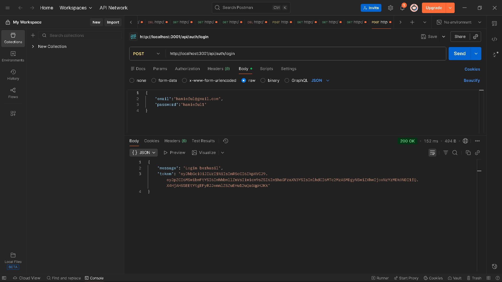
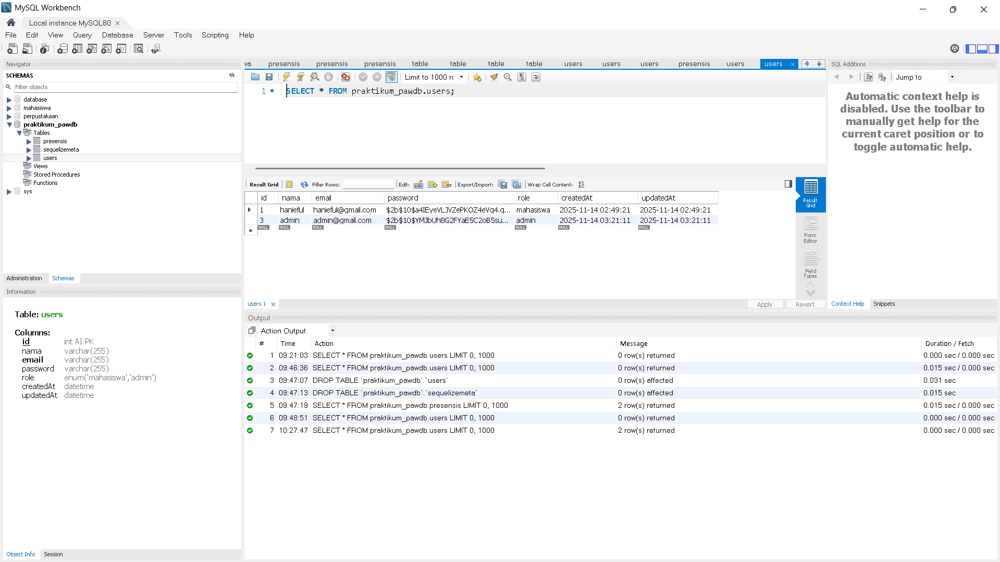

Request POST /register (untuk membuat user "mahasiswa")

Request POST /register (untuk membuat user "admin").
.png>)

Request POST /login (login sebagai "mahasiswa" dan mendapatkan token).

Database table User

